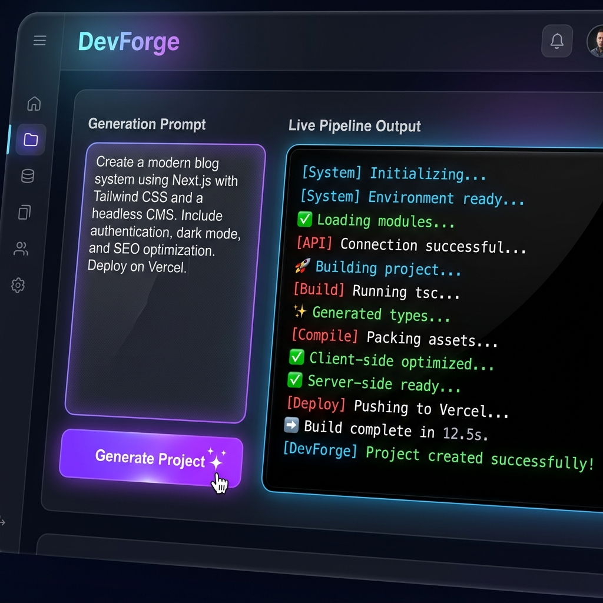
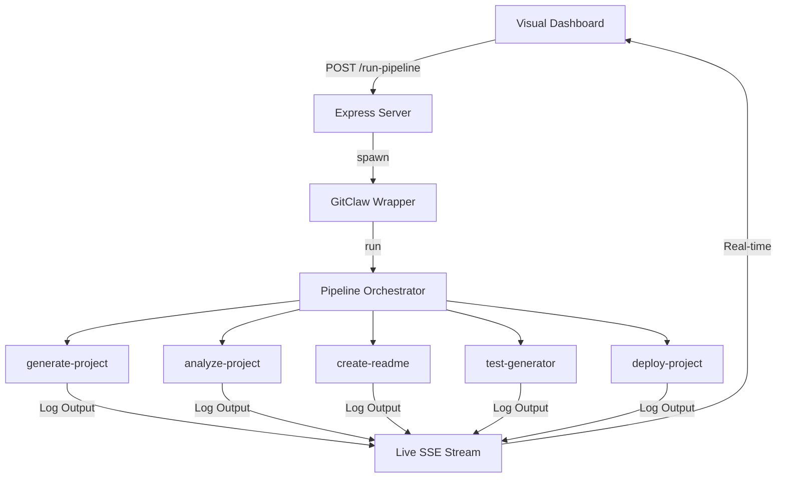

# 🛠️ DevForge: The Autonomous AI Software Factory

[](https://ollama.ai)
[](https://nodejs.org)
[](https://expressjs.com)
[](https://github.com/VishnuVardhanCodes/devforge-ai-agent)

**DevForge** is a next-generation AI developer agent that automates the entire software engineering lifecycle. Built for high-stakes hackathons and rapid prototyping, DevForge orchestrates a suite of specialized AI skills to deliver deployment-ready code, documentation, and tests in minutes.

---

## 📺 Dashboard Preview


*The DevForge Dashboard features a premium dark theme and real-time streaming logs via Server-Sent Events (SSE).*

---

## 🚀 Key Features

- **🧠 Pipeline Orchestration**: A central brain that coordinates specialized skills for generating, analyzing, and explaining projects.
- **👁️ Visual Command Center**: A modern web UI with real-time feedback and log streaming.
- **🏠 Private & Secure**: Integrated with **Ollama** (TinyLlama) for local AI execution—no API keys required.
- **🤖 Professional Demo Mode**: A pre-built simulation engine for flawless hackathon presentations.
- **📂 One-Click Scaffolding**: Generate everything from REST APIs to Real-time Chat apps with a single prompt.

---

## 🏗️ Technical Architecture

DevForge uses a modular "Skill-Based" architecture to ensure high-quality output and maintainability.



---

## 🛠️ Built With

- **Backend**: Node.js & Express
- **AI Adapter**: [Ollama](https://ollama.ai) (TinyLlama)
- **Engine**: @open-gitagent/gitagent
- **Frontend**: Vanilla JS (ES6+), Modern CSS (Inter & JetBrains Mono)
- **Real-time Engine**: Server-Sent Events (SSE)

---

## 🏁 Quick Start

### 1. Requirements
Ensure **Ollama** is running on your system:
```bash
ollama pull tinyllama
```

### 2. Installation
```bash
npm install
cd ui && npm install
```

### 3. Launch Dashboard
```bash
cd ui
node server.js
```
Open `http://localhost:3000` to start building!

---

## 🏆 Judge-Friendly Demo Modes

We've prepared specific "Golden Path" demos for judges. Use the **Professional Demo Mode** to ensure a perfect presentation every time.

| Mode | Command | Prompt Description |
| :--- | :--- | :--- |
| **Todo API** | `./run-demo.sh demo-prompts/todo-api.txt` | Fully documented RESTful Todo API with JWT & Tests. |
| **Chat App** | `./run-demo.sh demo-prompts/chat-app.txt` | Real-time chat using Socket.io and React. |
| **E-commerce** | `./run-demo.sh demo-prompts/ecommerce-api.txt` | Complete backend with product catalog & Stripe mock. |

---

Built with ❤️ by the DevForge Team.